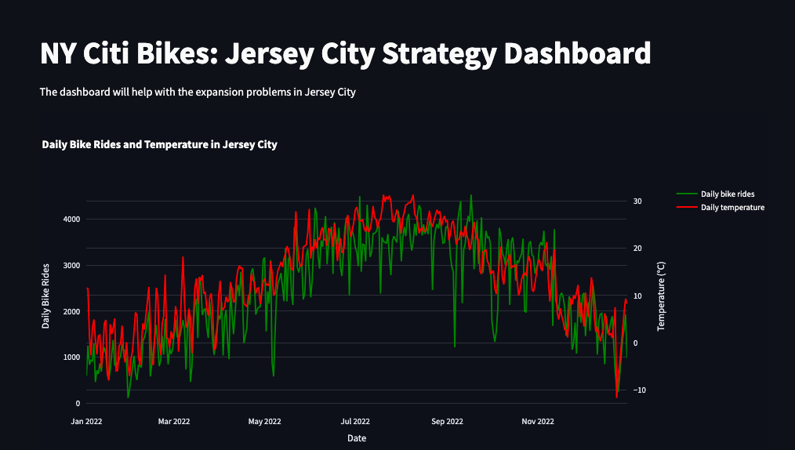
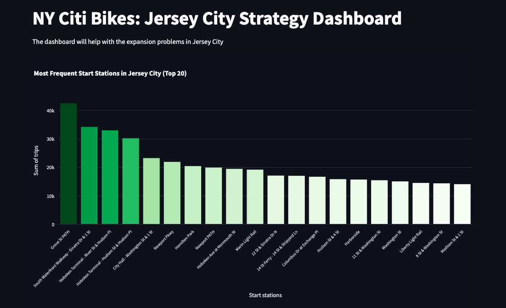
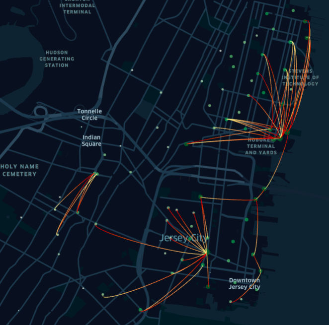

# Creating a Strategic Dashboard: NY Citi Bikes in Jersey City

###### This project was completed as a requirement for the course, Data Visualizations with Python, by CareerFoundry as part of their Data Analytics Certificate Program.

## Project Objective

##### You are the lead analyst for a bike-sharing service based in New York City, USA, which also provides service in Jersey City. Your team has been tasked with analyzing user behavior to help the business strategy department assess the current logistics model of bike distribution in Jersey City and identify expansion opportunities.

##### The project’s objective is to conduct a descriptive analysis of existing data and discover actionable insights for the business strategy team to help make informed decisions that will circumvent availability issues and ensure the company’s position as a leader in eco-friendly transportation solutions in the city.

## Context

##### For this project, you’ll be using public data from New York bike-sharing facilities operated by Citi Bike. For context, Citi Bike’s popularity has increased since its launch in 2013. The company’s marketing strategy promotes bike sharing as a sustainable and convenient means of transportation, which has been very successful. Since the Covid–19 pandemic, Jersey City residents have found even more merit in bike sharing, creating higher demand. This has led to distribution problems—such as fewer bikes at popular bike stations or stations full of docked bikes, making it difficult to return a hired bike—and customer complaints.

##### The task is to diagnose where distribution issues stem from and advise higher management on a solution based on your diagnosis of the root of the problem—whether it’s sheer numbers, seasonal demand, or something else. Being in a management position also makes you the bridge between divisions, which requires you to ensure the information is tangible for the business development team. To effectively communicate your analysis to non-analysts, you’ll present your insights in an interactive dashboard depicting the metrics you identify as vital for tackling the distribution issues.

## Tools/Skills Used
##### Skills: Sourcing Data with API Key, Data Visualization with Python, Geospatial Plotting, Creating a Dashboard
##### Python: pandas, numpy, os, beautifulsoup, streamlit, pillow, kepler.gl, matplotlib, seaborn, pyplot, numerize

## Data
##### Open Source Data from Citi Bike's Database: https://s3.amazonaws.com/tripdata/index.html
##### Weather data using NOAA's API Service: https://www.noaa.gov/

## Initial Questions and Plan for Dashboard

##### The following are a list of initial questions to guide the analysis. Any unanswered questions are a potential direction for further research. 
###### 1. What are the most popular stations in the city?
###### 2. Which are the months with the most trips taken? Is there a weather component at play?
###### 3. What are the most popular trips between stations?
###### 4. Are the existing stations evenly distributed?
###### 5. Are certain stations more or less popular depending on time of day/week/year?

##### Elements to Include in Dashboard (to answer initial questions)
###### 1. Bar Chart: to show most popular stations
###### 2. Line Chart: number of trips throughout the year
###### 3. Map: to show trips being taken and whether stations are evenly distributed

## Analysis Steps
##### Step 1. Source Data and Merge all Datasets (Notebook 2.2)
###### 1a. Import all files for NY Citi Bike trips (Jersey City only - data for NYC is on a separate file that was not used for this project)
###### 1b. Gather weather data from NOAA using API
###### 1c. Inspect and Explore Data
###### 1d. Merge all dataframes
##### Step 2. Create First Visualizations and Observe Insights (Notebooks 2.3 and 2.4)
##### Step 3. Initiate Map (Notebook 2.5)
##### Step 4. Recreate Charts for Dashboard Using Plotly (Notebook 2.6)
##### Step 5. Execute Python Script to Create Dashboard
##### Step 6. Deploy Dashboard and Record Final Presentation (link below)

## Insights

### Weather

#### 

#### There is an obvious correlation between the rise and drop of temperatures and their relationship with the frequency of bike trips taken daily. As temperatures plunge, so does bike usage. This insight indicates that the shortage problem may be prevalent merely in the warmer months, approximately from May to October. Below are more specific initial insights:

##### 1. There are noticeable points of drops in bike usage. The first in early October; followed by a more signifcant drop in mid-November, and again in mid-December (into the holiday season).
##### 2. There are individual days of particularly low bike-usage that don't seem to correlate with temperature. The two lowest days for bike usage in 2022 are January 29th (a Saturday) and December 25th. Other noticeably low-use days (in relation to their particular time period) are March 12th (Saturday), May 7th (Saturday), September 6th (Tuesday), and October 3rd (Monday). Further research recommended to find reason for these 'isolated dips.'
##### There are noticeable points of rises in bike usage in mid-February, mid-March and mid-April. Peak usage is reached in May and is sustained until October.

### Most Popular Starting Stations and Routes in Jersey City

#### 

#### Three Main Hubs
##### There are three main hubs for bike usage (which are visible by observing the 'route arcs'). 'Hub 1' around in the area of Hoboken Terminal and Yards/Stevens Institute of Technology (parallel to the Meatpacking District in Manhattan); 'Hub 2' south (slightly west of what is labeled Downtown Jersey City); and smaller 'Hub 3' furhter west (near Indian Square). I will focus my insights mostly on Hub 1 and 2. There is also a much smaller Hub 4 in downtown Jersey City, by the water (parallel to Battery City Park in Manhattan).

#### 

#### Hub 1
##### The 2nd, 3rd, 4th and 5th most popular starting stations (South Waterfront Walkway at Sinatra & 1st, Hoboken Terminal at River & Hudson, Hoboken Terminal at Hudson St. and Hudson Pl, and City Hall at Washington and 1st) are all in Hub 1, and are all located within the same area of Hub 1. The most popular routes in Hub 1 flow to and from these four centralized stations

#### Hub 2
##### The most popular starting station in Jersey City is Grove Street, which appears to be the center of Hub 2. The most popular routes in Hub 2 flow to and from Grove Street.

#### Hub 1 vs. Hub 2
##### Hub 1 and Hub 2 both clearly have a 'central area', however Hub 1 has four main stations at its' center, whereas Hub 2 only has one (Grove Street, which is the most popular station of all).

#### Popular Stations Between Hubs 1 and 2
##### Newport Pkwy, Hamilton Park, and Newport Path are the 6th-8th most popular starting stations. All three locations are in the same area in between Hubs 1 and 2, suggesting that these three popular stations may be connecting stations in between the two main hubs.

## Recommendations for Further Research

#### The analysis has shown that NY Citi Bikes should focus on the following objectives moving forward:
##### 1. Scale back number of bikes after October. This can be done in phases, according to the three points of drops in bike usage (in early October; followed by a more signifcant drop in mid-November; and again in mid-December). Further statistical analysis recommended to determine how much to scale back in each phase.
##### 2. Conversely, after the winter, increase the number of bikes in three phases according to the noticeable points of rises in bike usage (mid-February, mid-March and mid-April). Further statistical analysis recommended to determine how to implement the increase of bike as the temperature rises in through the late winter/spring.
##### 3. In Hub 1, the four most popular 'central stations' are all situated near the waterfront. Additional analysis is required to assess if these four stations can manage being the central stations of this hub; or if these stations should be expanded or if additional stations should be established in the area to alleviate congestion at these four locations.
##### 4. In Hub 2, further analysis is recommended to assess whether Grove Street can manage being the central station of this hub, or if the station should be expanded or additional stations introduced in the area to reduce congestion.
##### 5. To ensure that bikes are consistently available at the most popular locations, further analysis is necessary to identify specific times of day when these stations predominantly serve as either origin or destination points. During periods when they function primarily as origin stations, it may be important to ensure that an adequate supply of bikes is maintained by replenishing the stock frequently. Conversely, when these stations act as key destinations, efforts should be focused on clearing returned bikes quickly to free up docking space and redistribute them to areas with higher demand for departures.

## Final Presentation
##### https://www.youtube.com/watch?v=n9ltnVQ1rDw

